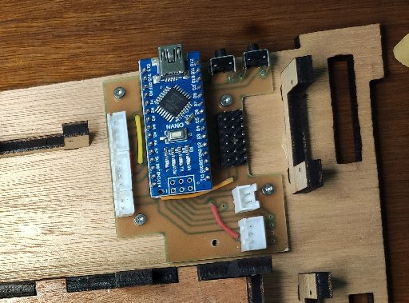

# Useless Box - Bottom

**[Home](readme.md)** --
**[Electronics](electronics.md)** --
**[Wood](wood.md)** --
**[Top](top.md)** --
**Bottom** --
**[Software](software.md)**

Now that we have hooked all the wiring up to the top, we start building the
**bottom** of the box.

### 1. Attach PCB

I start by attaching the PCB using 4-5 M2 screws.  The screws go
directly into the laser cut holes in the wood.

Adding the PCB first allows me to get the lengths of
the wires for the power connector right.

### 2. Insert Battery Holder and Glue Switch in place

Feed the wires from the battery holder through the holes and
insert the battery holder from the bottom.   Determine the
lengths needed for the power switch and JST connector then cut the wires.

Strip them and solder the wires and switch together using some heat
shrink tubing to cover the wire solder joints.

For lack of a better solution, I then use 5 minute epoxy to glue the
switch into the 3D printed piece, and glue that to the bottom.

**it is important to get the position of the switch correct so that
the top can be attached via two M2 screws on the back!!**.  The only
purpose of the 3D printed piece is to provide screw holes for the top
to attach.

One alternative way of doing this would be to glue the switch to
the 3D printed part, let that dry, then **screw the assembly to the
top** and **then** put a little glue on the bottom and place the
top on the bottom to get the positioning correct.

Personally, I just eyeballed it to the center, remembering to allow a little
space (1/2 mm) between the top and the bottom and held it in place with
my hand while the 5 minute epoxy set up.

### 3. Install Servos and Route Wires

Attach the control arms and servos for the lid and the arm and
attach the servos to the bottom using the screws that come with
the servos.  *note: I started using **MG90S** servos, with metal
gears, for the arm and lid because, although the 7.4V does not
burn out the motors, the nylon gears are not up to the task of
repeatedly opening the lid and turning the switch off.*

I also epoxied the 3D printed **front screw holder** into the
correct place at this point in the process.

As you install the servos it is a good idea to *route* the wires
so that they will not interfere with any of the servos or get
in the way between the top and the bottom.   So I start adding
twist ties at this point in the process as I add each servo.

Note that **the wheels have a hole in them so that you can
get to the servo mounting screw**.  You put the rubber O-rings
on the wheels, then screw the wheels onto the servos, **then**
mount them on the bottom.   At that point you have something
that looks like the following, and we are nearly done.

### 4.  Assembly Done!

All that is left for the physical assembly is to place the top on
the bottom, insert **two M2 screws** in the back, and **one M3 screw**
in the front and sliding the **lid lift piece** into the guide.

By the time I got to the second box I had already completed the software,
so before closing up the box I did a test, by loading the software on the
Arduino, putting some batteries in it, and making sure everything was working.

**Make sure the lift piece can slide freely in the guide!!**  Also, **you may
need to cut the lift piece to length** so that it sits 2mm or so below the top
when the lift arm is in the **down** position.

**finished box**

**Next:** Compile and Install the [**Software**](software.md) for the box ...
