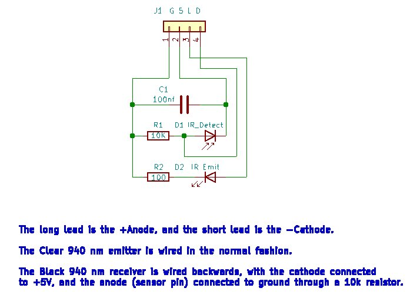
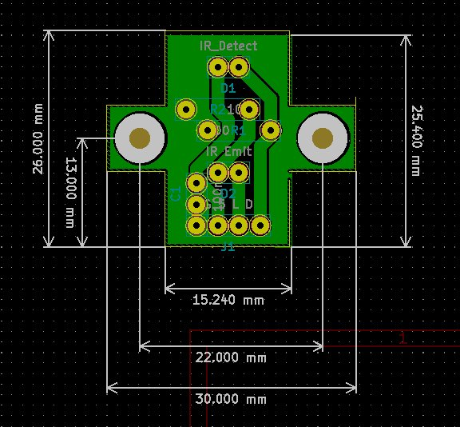
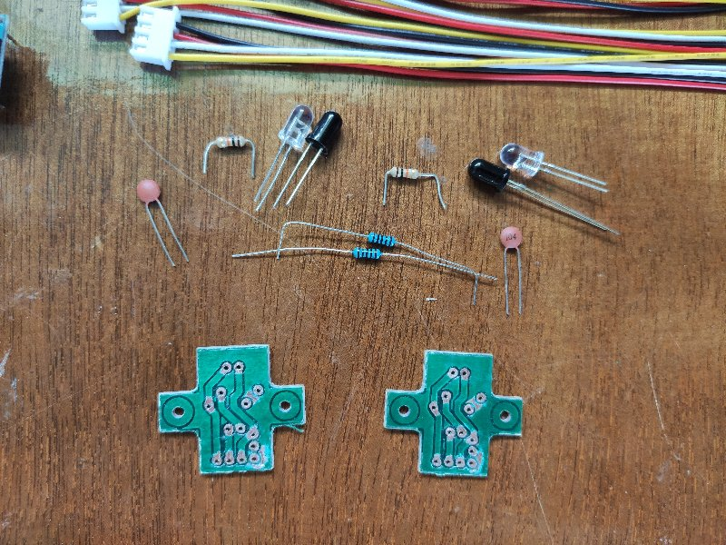
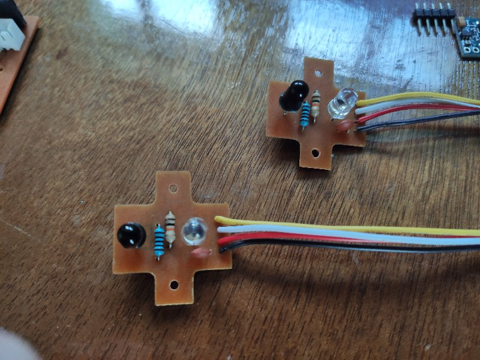
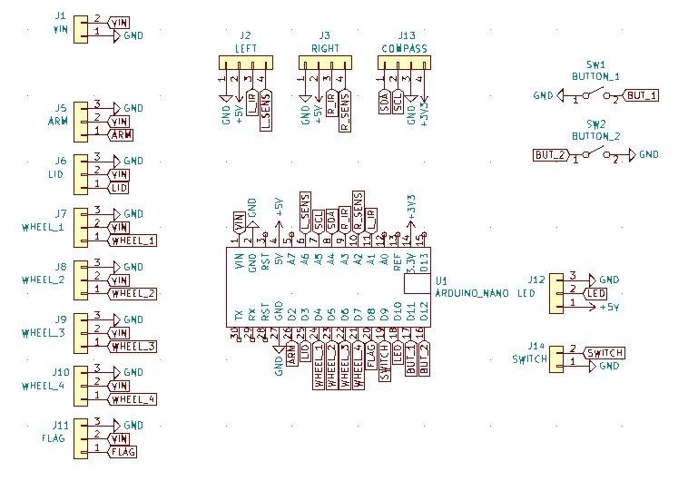
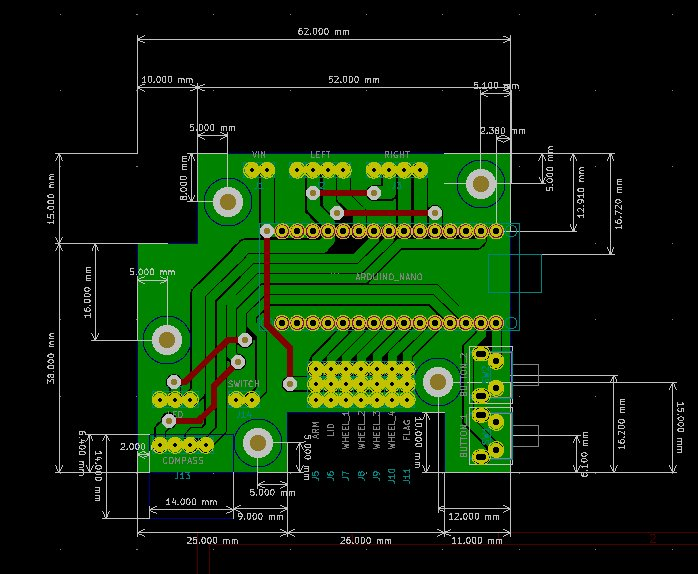
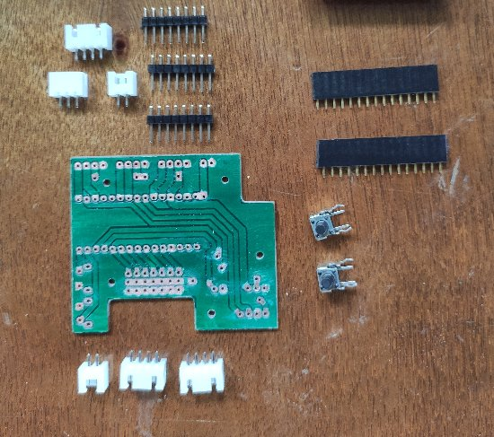
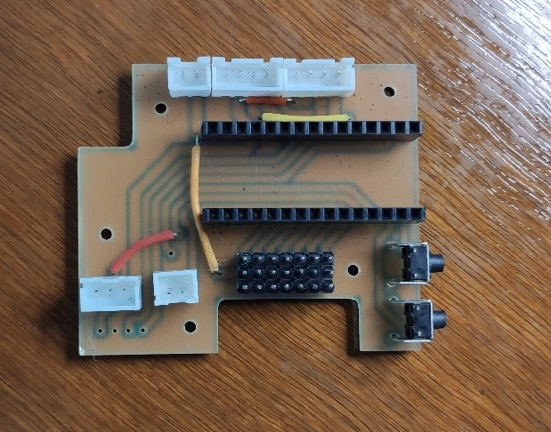
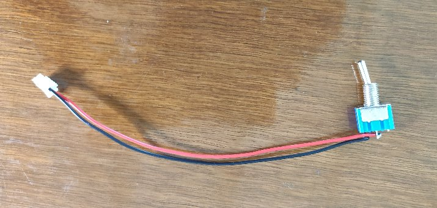
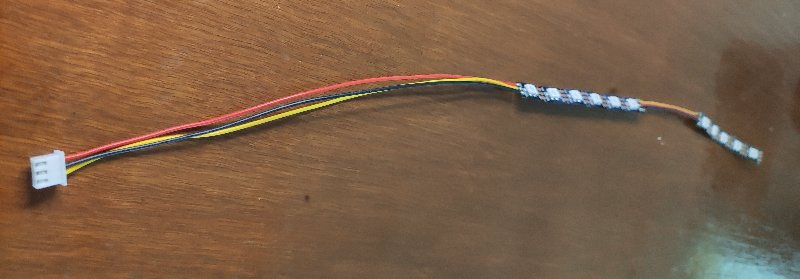

# Useless Box - Electronics

**[Home](readme.md)** --
**Electronics** --
**[Wood](wood.md)** --
**[Top](top.md)** --
**[Bottom](bottom.md)** --
**[Software](software.md)**

Coincident with the fusion *Design* process, I also started some **kicad** projects to
start making the circuit board(s).   I knew the motherboard would be oddly shaped and have to
fit in a limited area, and I also had to work out a layout that would allow me to plug a
USB cable into it for programming, as well as position two buttons so they could be accessed
via toothpicks through the side of the box.

All of the files for the kicad **schematics** and **PCB boards**, as well as the **flatcam**
projects I used, and the **gcode** it produced that I used to etch, paint, drill, and cut
the PCB boards can be found in the **docs/kicad** folder.

### Sensor Boards

At first I thought I would just glue some IR emmitter and reciever diodes into the top of
the box, but decided that it would be better to make some little circuit boards to hold
them (and to allow for some on-board resistors).  Here is the schematic for the sensor
board:

And here is the kicad PCB board:

After collecting the parts together ...

I soldered the diodes, capacitor, resistors, and wired JST connector to the boards:

### Main Cicruit Board

Here is the schematic for the circuit board:

And here is the kicad PCB board:

After collecting the parts together ...

I soldered everything (wires, connectors, etc) to the board:

### Solder Switch and LEDs

I also prepared for the assembly by soldering a 2 wire JST connector to
the **switch** and a three wire JST connector the the **LED Strip(s)**.

The LED Strip is divided into two parts.  The first 6 LEDs will be on the
inside of the box to light up when the lid opens, and the last 5 LEDs will
show through to the user for some kind of a display.

**Next:** Constructing the [**Wood**](wood.md) top and bottom of the box ...
