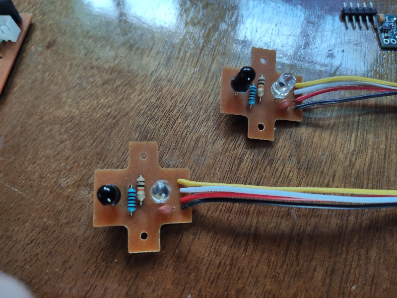
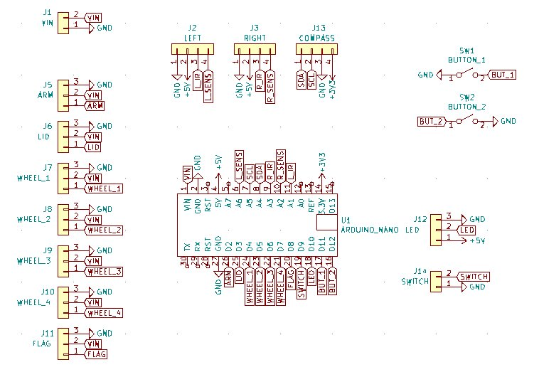

# Useless Box

For the fun of it, I mada a **Useless Box**.

**Insert YouTube movie here**

## Requirements

I decided on the following basic set of requirements for my useless box

- random **behaviors** - it will be controlled by an arduino nano with various random behaviors
- **mobility** - it will have motors and semi-hidden wheels so it can spin, move left and right, etc
- **sensors** - it will have sensors, probably infrared, to detect when a human tries to touch it
- **leds** - it will have a string of WD2812b leds that will light up the interior for effect and probably some on the top to show the user
- **buttons** - it will have a couple of toothpick accessible buttons to allow the user to configure it to some degree
- **on-off switch** - it will have an on/off switch to the power supply
- **batteries** - it will use rechargable 18650 Lithium batteries, because I have a bunch of those, and pre-made plastic holders for them
- **nicely constructed** - it will look nice, like a bit of a wood working effort

I had recently upgraded my [**home built cnc machine**](https://github.com/phorton1/Arduino-esp32_cnc20mm) with a new 10W laser, and
had been having a lot of fun making wooden boxes with it, and this seemed like a perfect opportunity to combine that with
some electronics and programming to make something interesting.  I had a bunch of inexpensive **3/16" plywood** that I had
become proficient in cutting and glueing, so I decided the box would be made out of that.

So I set off into Fusion 360 to design it.

## Design

I decided to use small MG90 Servos.  I tested them against a dual 3.7V (7.4V total) 18650 battery pair and, although they get hot
if left running continuously, for short bursts they work ok, and in my application they would not need to be kept running or
holding any positions against any serious forces.  The extra voltage (they are rated at 5V) resulted in extra torque so I felt
that I did not need the much larger kinds of servos that other similar box makers seemed to insist on using.

I also knew that I had bought a number of of "continuous" MG90 servos (by mistake) for an earlier project.  Those turned out to
be perfect for running the motors for the wheels.  I can easily control which way, as well as the speed, each wheel turns with a fair degree
of accuracy.

I decided I would 3D print wheels that made use of some 30mm rubber O-rings that I had.

I used one piece of **1/8" plywood** for the partition.

All of the **fusion360 files* and the **STL** and **DXF** files exported from fusion, as well as
the **Prusa Slicer** and **Gcode** files and **Lightburn** projects I then used to print the
plastic parts and laser cut the wood can be found in the following subdirecties in the **docs** folder

- **fusion** - the fusion 360 design files
- **stl** - the STL files that I used to slice the plastic parts
- **dxf** - the DXF files that I used to laser cut the wood parts
- **prusa** - the Prusa slicer files and resultant gcode I used to print the plastic parts
- **lightburn** - the Lightburn projects I used to cut the wood.

### Bill of Materials

- one SPDT blue switch and nut for the top
- one slider SPST switch for the power supply
- a 2 cell 18650 battery holder
- two 90 degree MG90 servos and screws
- four continuous MG90 servos and screws
- four 30x2mm rubber O-rings
- two M2x12 screws for the back
- one M3x12 screw for the front
- four or five small screws to hold the main circuit board
- two four wired JST connectors for the sensors
- two two wired JST connectors, one for the power supply, and one for the switch
- two sensor cicruit boards, made below
- one main circuit board, made below
- 3D printed parts, made below
- laster cut wood parts, made below

## Electronics

Coincident with the fusion *Design* process, I also started some **kicad** projects to
start making the circuit board(s).   I knew the motherboard would be oddly shaped and have to
fit in a limited area, and I also had to work out a layout that would allow me to plug a
USB cable into it for programming, as well as position two buttons so they could be accessed
via toothpicks through the side of the box.

All of the files for the kicad **schematics** and **PCB boards**, as well as the **flatcam**
projects I used, and the **gcode** it produced that I used to etch, paint, drill, and cut
the PCB boards can be found in the **docs/kicad** folder.

### Sensor Boards

At first I thought I would just glue some IR emmitter and reciever diodes into the top of
the box, but decided that it would be better to make some little circuit boards to hold
them (and to allow for some on-board resistors).  Here is the schematic for the sensor
board:

And here is the kicad PCB board:

After collecting the parts together ...

I soldered the diodes, capacitor, resistors, and wired JST connector to the boards:

### Main Cicruit Board

The circuit (and software) can optionally use a HMC5883 **compass module**
so that it can orient itself while spinning, but after some testing, I
decided it was not worth the extra complexity and cost (and it didn't
work that well).  So the circuit board I created leaves the slot for
the compass unpopulated.

It also allows for another servo (the "flag" servo) for future enhancements
where I might want an additional servo to do something like showing a white
"surrender" flag.

Here is the schematic for the circuit board:

And here is the kicad PCB board:

After collecting the parts together ...

I soldered everything (wires, connectors, and buttons) to the board:

## Assembly

## Software and Testing

One early discovery was that WS2812b LEDs are basically completely incompatible
with most Arduino servo libraries.  If you change the LEDs while the servos are
running, interrupts get turned off while writing to the WS2812s, and the servos
jitter and jump around. After quite a bit of wrangling with the issue, I finally
just gave up and coded the program so that the servos are never running when the
LEDs are changed, and vice-versa.

### Required Arduino libraries

### Design

### User Interface

## License

This program is free software: you can redistribute it and/or modify
it under the terms of the GNU General Public License Version 3 as published by
the Free Software Foundation.

This program is distributed in the hope that it will be useful,
but WITHOUT ANY WARRANTY; without even the implied warranty of
MERCHANTABILITY or FITNESS FOR A PARTICULAR PURPOSE.  See the
GNU General Public License for more details.

Please see [LICENSE.TXT](https://github.com/phorton1/Arduino-libraries-myIOT/blob/master/LICENSE.TXT) for more information.
