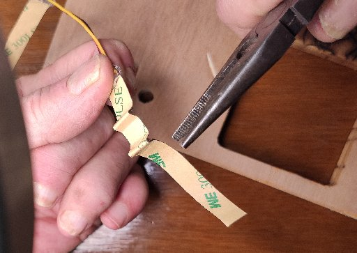
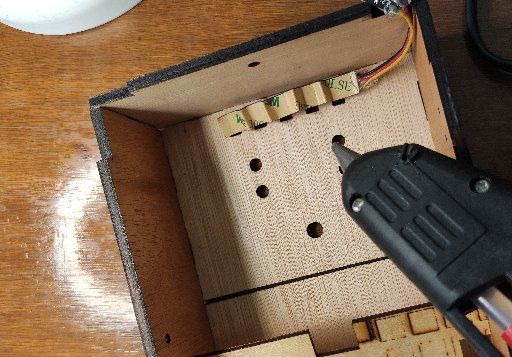
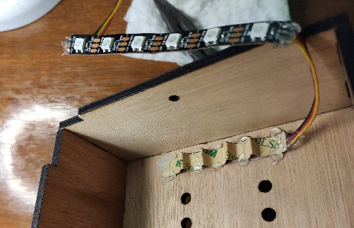
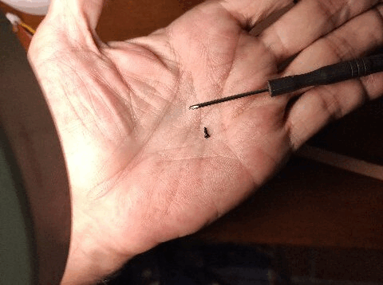
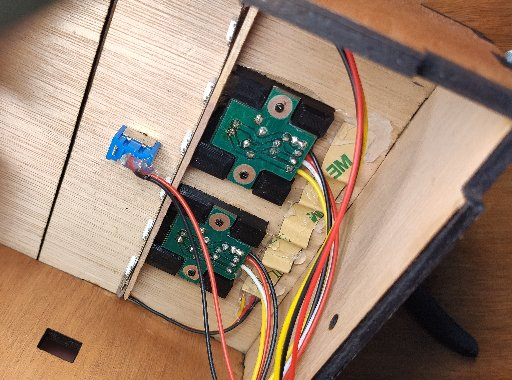
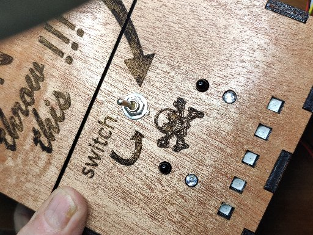
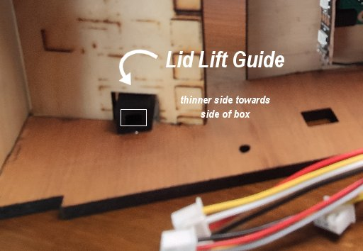

# Useless Box - Top

**[Home](readme.md)** --
**[Electronics](electronics.md)** --
**[Wood](wood.md)** --
**Top** --
**[Bottom](bottom.md)** --
**[Software](software.md)**

I do the assembly **starting with the top of the box** to which we
add the LEDs, Sensors, Switch, and Lift-Arm guide.

### 1. Hot Glue LED strip into top

Uhm, the current design has holes for 5 LEDs.  I designed that part without
really thinking it through.  The spacing of the holes does not match the
spacing of the LED strip!!

A creative implementation solution to this design problem was to **accordian
the LED strip** so that it fit into the 5 holes, then while holding the LEDs
in the holes, hot glue it into place.

*I should probably build a 3rd Useless Box **just** for documentation purposes,
and fix this problem!!  I think 3 LEDs would be sufficient for the top.*

### 2. Attach Sensor Boards and Other LED Strip

Using some tiny wood screws, attach the two sensor boards to the 3D printed
pieces.  Then I used 5 minute epoxy to glue those to the top.  This will allow
me to replace the sensor boards if I need to.

After the sensor assemblies are glued to the top, I cut the ends off
a popsicle stick, epoxied that to the front of the sensor plastic, and
used the adhesive on the LED strip to attach them.

### 3. Attach Switch

Attach the switch assembly to the top with it's associated
nut, being careful to align the switch to that it is ON when the
switch is moved UP (and the arm will turn it OFF when the arm hits it).

The top, with it's dangling set of JST connectors, is now nearly finished.

### 4. Epoxy the Lid-Lift guide into place

This is also a good opportunity to epoxy the **lid lift guide**
to the top.

The **lift guide** should be centered in the hole in the partion,
with it's *thinner side* glued to the side of the top.   It should
be about **3-5 mm** from the top of the box so that the arm
can stick out of it a bit, and yet still not contact the top.

**Next:** Assemble the [**Bottom**](bottom.md) main assembly ...
