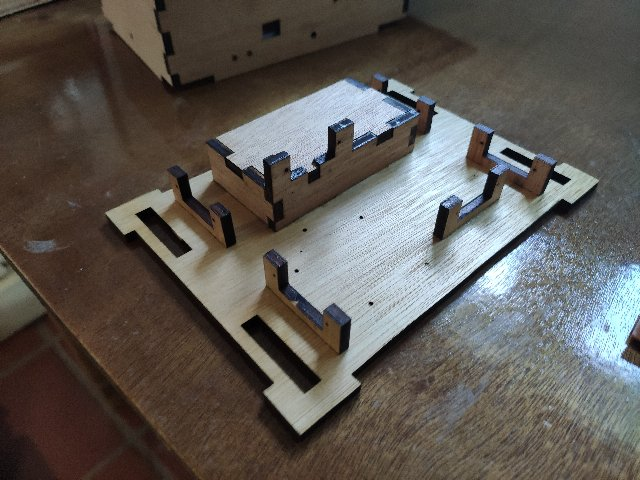
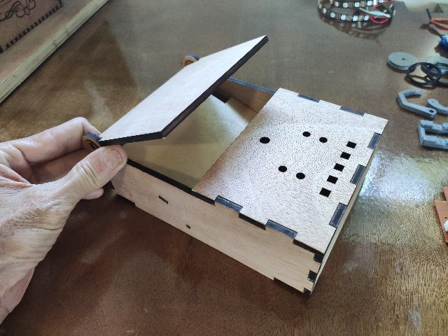

# Useless Box - Wood

**[Home](readme.md)** --
**[Electronics](electronics.md)** --
**Wood** --
**[Top](top.md)** --
**[Bottom](bottom.md)** --
**[Software](software.md)**

*note: these pictures are from two different boxes I assembled,
one without any engraving on the outside, and one with engraving.*

I like to finish my laser cut projects with a laquer or enamel clearcoat
as soon after cutting as possible, particularly when there is engraving,
to seal in the burnt carbon, and the images, before I handle them very
much.   I typically finish sand my rough wood before I cut it, once again,
especially if there will be engravings on it.  You don't really want to
sand (or even handle) laser engraved pieces very much before they are
finished or else the black carbon will flake or get rubbed off.

Ideally, after 1-2 coats of clearcoat, with light sanding between, I will
then sand and finish the edges a bit.  I like to sand a 45 degree bevel on
the edges of the wood so that a bright line forms on the side.

In the case of this useless box, I didn't take many pictures of this part
of the process.  I believe I did a single clear coat before glueing anything
together.

**The wood bottom**

Essentially you start by using wood glue to glue the bottom wood pieces together.
The bottom pieces go together very easily, so after gluing, you set that aside to dry.

Gluing the top pieces together is bit of a complicated and hectic process.
**Make sure that everything dry fits before starting!!**  Once you start
putting glue on the bare wood, you have to finish it all in one fell swoop.

You build the top from the left side, starting by inserting the partition piece,
and the back and front at roughly 90 degree angles to the left side. I build it
around the bottom as I go (being careful, of course, to NOT glue the bottom to
the top) to make sure it will all be sort of square when finished.

It's complicated :-)

Before the glue on the left, partition, back, and front sets, you
quickly glue the fixed top piece.  Then **the hardest part**.  While
*somehow holding the whole thing together*, you set the (moveable) **lid** in place,
with it's fingers just floating in the big hinge holes, and you **get the right
side on**.  Press it together and align it all with your hands before gingerly
placing small clamps on it to hold it while the glue dries.

**The wood top**

After that dries, you (sand and) glue the **circular hinge pieces** in place.

You should end up with two pieces ... the bottom, that will hold the
arduino, batteries, and servos, and the top, with a freely moving lid,
that will hold the switch, sensors, and LEDs.

After it is glued, coat 2-5 times with clear laquer or enamel avoiding
getting too much paint into the hinges.

**Next:** Assemble the [**Top**](top.md) by adding the LEDs, sensors, and switch ...
